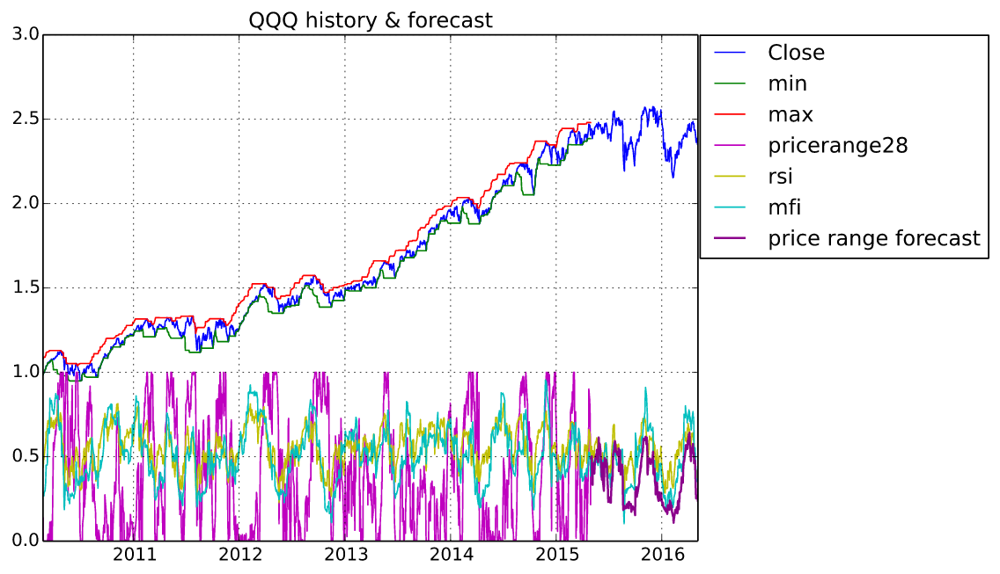
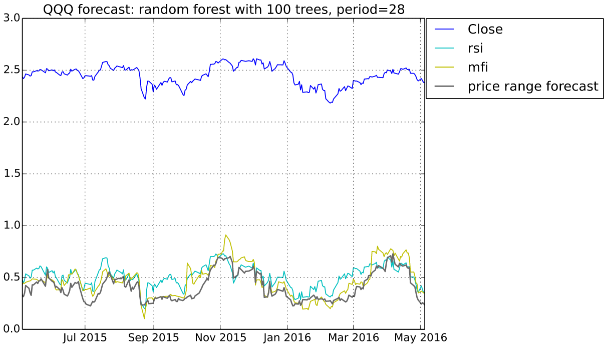

# FinancialData

## Use random forest to forecast price range index

## 3-fold cross validation on regression forest
Fold 1  
Mean Squared Error:     0.038009256981608494  
Correlation Coeff:      0.8747747318604603  
Coeff of Determination: 0.6709654572877999  

Fold 2
Mean Squared Error:     0.03804018675741687  
Correlation Coeff:      0.8808481398180632  
Coeff of Determination: 0.6811239733381976  

Fold 3
3-element Array{Float64,1}:  
 0.670965  
 0.681124  
 0.689243  

Mean Squared Error:     0.03745480033468617  
Correlation Coeff:      0.8883541074206337  
Coeff of Determination: 0.6892429251664626  

Mean Coeff of Determination: 0.6804441185974867
