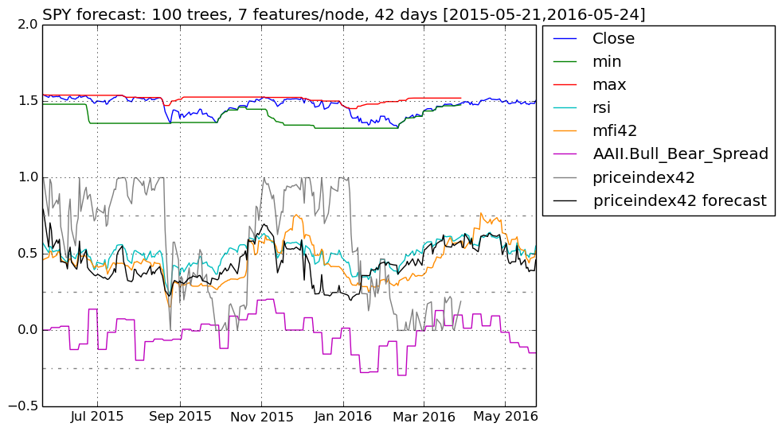
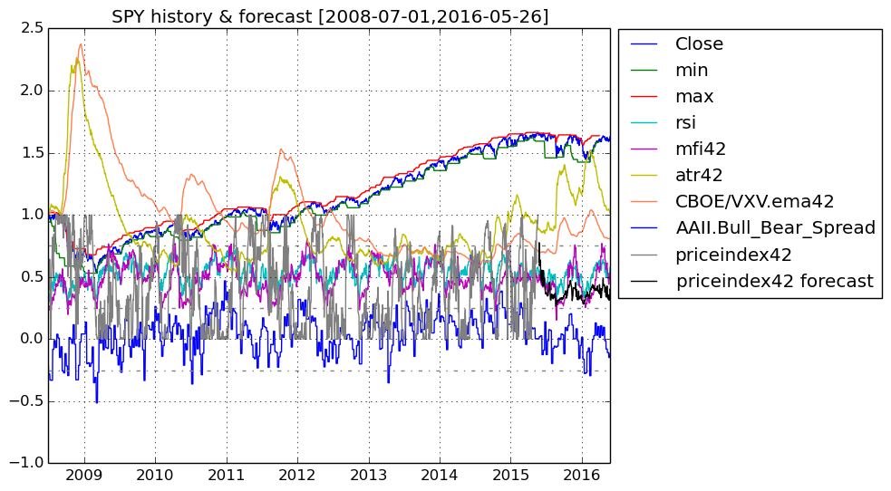
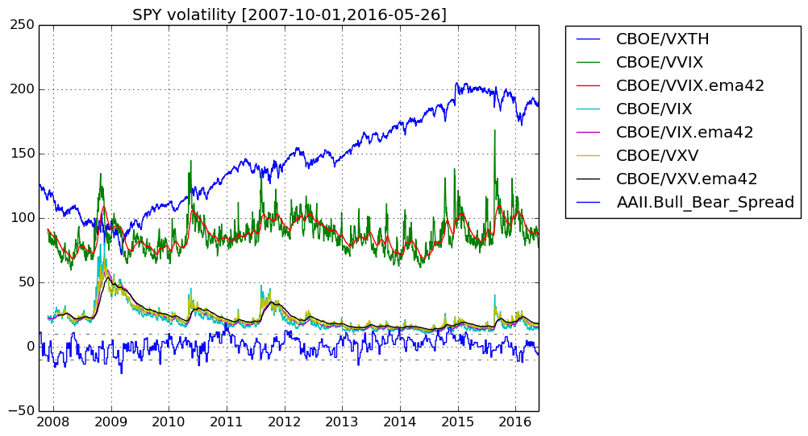

# FinancialData

## This Julia program fetches financial data from Yahoo Finance/Quandl and forecasts short-term price ranges in the future using random forests.

## Results

### Ensemble of Decision Trees

Trees:      100  
Avg Leaves: 415.12  
Avg Depth:  26.88  

### 3-fold cross validation on regression forest

Fold 1  
Mean Squared Error:     0.015033534034513796  
Correlation Coeff:      0.9518909365843077  
Coeff of Determination: 0.867136888499935  

Fold 2  
Mean Squared Error:     0.01624191640497966  
Correlation Coeff:      0.9474620927437678  
Coeff of Determination: 0.8542292569882344  

Fold 3  
Mean Squared Error:     0.014815082334499172  
Correlation Coeff:      0.9542046896042672  
Coeff of Determination: 0.865878918462137  

#### Mean Coeff of Determination: 0.8624150213167687

