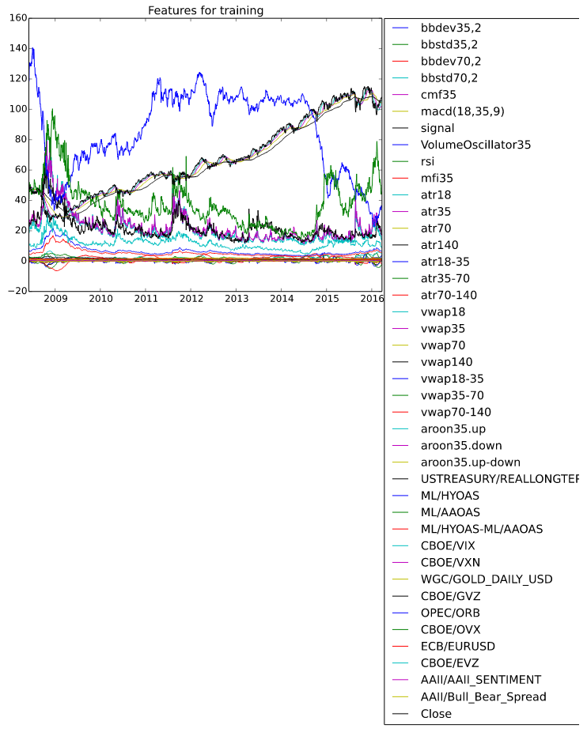

# FinancialData

## This Julia program fetches financial data from Yahoo Finance/Quandl and forecasts short-term price ranges in the future using random forests.

## Ensemble of Decision Trees  
Trees:      100  
Avg Leaves: 416.22  
Avg Depth:  27.64  

## Fold 1  
Mean Squared Error:     0.020437727886344337  
Correlation Coeff:      0.9342996148189757  
Coeff of Determination: 0.8151119160265008  

Fold 2  
Mean Squared Error:     0.02045890282761581  
Correlation Coeff:      0.9474735317549903  
Coeff of Determination: 0.8253620726850626  

Fold 3  
Mean Squared Error:     0.02072529642902459  
Correlation Coeff:      0.9305386390279952  
Coeff of Determination: 0.8118737050455446  

### Mean Coeff of Determination: 0.8174492312523692  
