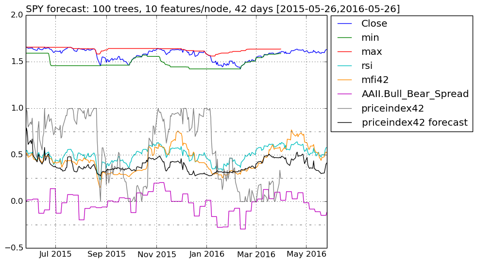
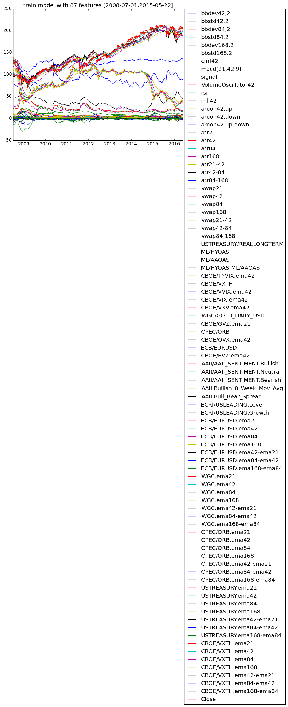

# FinancialData

## This Julia program fetches financial data from Yahoo Finance/Quandl and forecasts short-term price ranges in the future using random forests.

### Ensemble of Decision Trees

Trees:      100  
Avg Leaves: 416.19  
Avg Depth:  29.4

### 3-fold cross validation on regression forest

Fold 1

Mean Squared Error:     0.012036159321614691  
Correlation Coeff:      0.9549580067756521  
Coeff of Determination: 0.894024299981657

Fold 2

Mean Squared Error:     0.01431182020512534  
Correlation Coeff:      0.9441706076597861  
Coeff of Determination: 0.8710106400016819

Fold 3

Mean Squared Error:     0.012781266786704758  
Correlation Coeff:      0.9498329829348241  
Coeff of Determination: 0.8800594183329471

#### Mean Coeff of Determination: 0.8816981194387621

