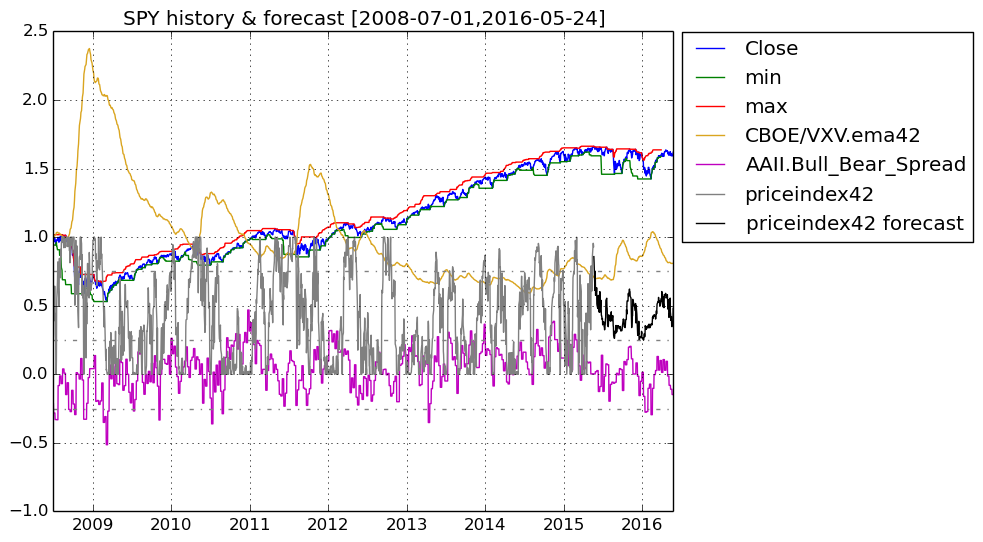
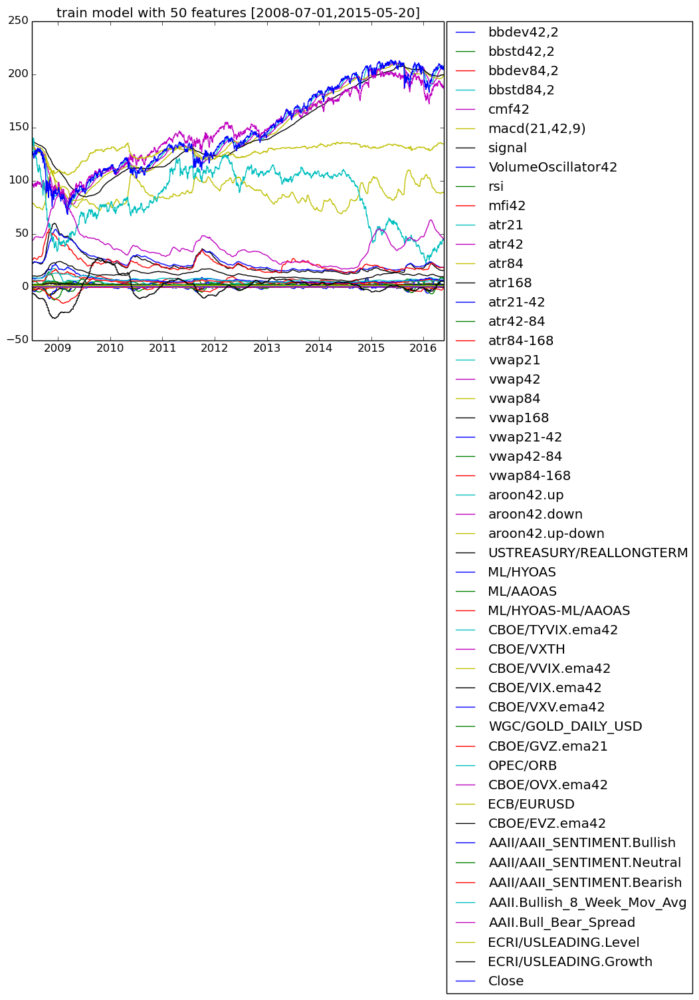

# FinancialData

## This Julia program fetches financial data from Yahoo Finance/Quandl and forecasts short-term price ranges in the future using random forests.

### Ensemble of Decision Trees

Trees:      100  
Avg Leaves: 416.86  
Avg Depth:  25.47

### 3-fold cross validation on regression forest

Fold 1  
Mean Squared Error:     0.015649203794115187  
Correlation Coeff:      0.9493500197951209  
Coeff of Determination: 0.8647841389287834

Fold 2  
Mean Squared Error:     0.014742097682867923  
Correlation Coeff:      0.9466981986834186  
Coeff of Determination: 0.8661617622079122

Fold 3  
Mean Squared Error:     0.015350116724958054  
Correlation Coeff:      0.9460608442532831  
Coeff of Determination: 0.8594209358939633

#### Mean Coeff of Determination: 0.863455612343553

