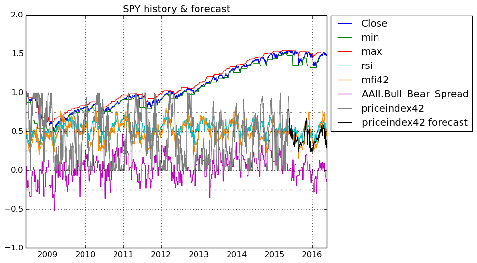

# FinancialData

## This Julia program fetches financial data from Yahoo Finance/Quandl and forecasts short-term price ranges in the future using random forests.

## Ensemble of Decision Trees

Trees:      100  
Avg Leaves: 414.48  
Avg Depth:  25.45  

## 3-fold cross validation on regression forest

Fold 1  
Mean Squared Error:     0.02033151115105683  
Correlation Coeff:      0.9380368696181755  
Coeff of Determination: 0.8282102802068232  

Fold 2  
Mean Squared Error:     0.019560745727889024  
Correlation Coeff:      0.9391934408083018  
Coeff of Determination: 0.83125961814471  

Fold 3  
Mean Squared Error:     0.02219339563413615  
Correlation Coeff:      0.9274984398716134  
Coeff of Determination: 0.808884707338017  

### Mean Coeff of Determination: 0.8227848685631834
