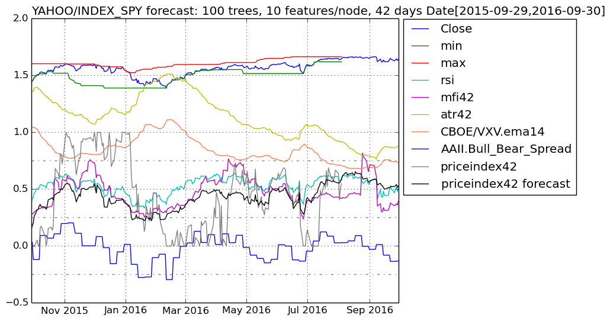
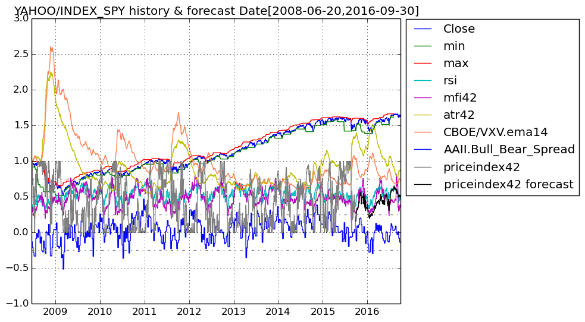
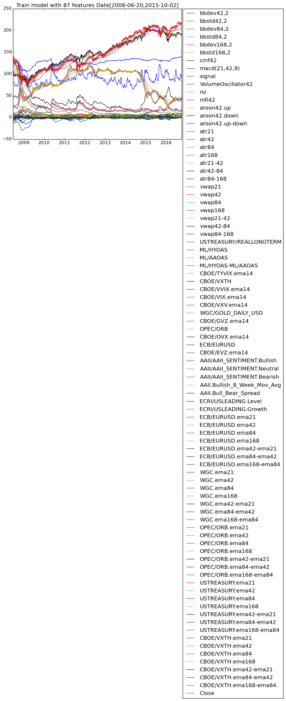
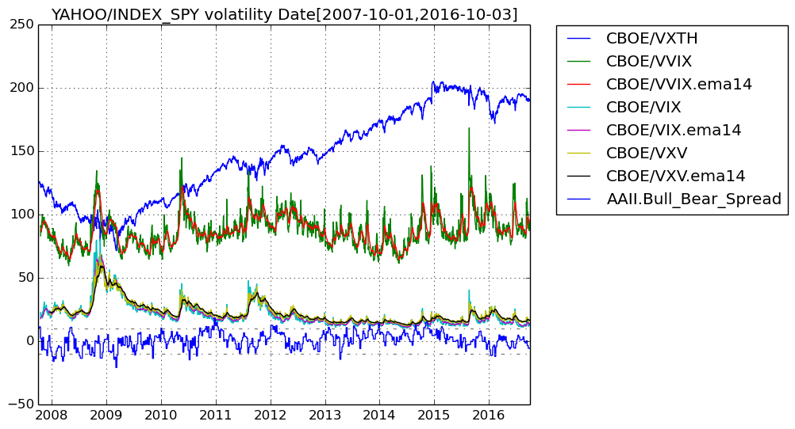

# FinancialData

## This Julia program fetches financial data from Quandl/Yahoo Finance and forecasts short-term price ranges using a random forest.

### Ensemble of Decision Trees  
Trees:      100  
Avg Leaves: 438.84  
Avg Depth:  30.3  

### 3-fold cross validation on regression forest  
Fold 1  
Mean Squared Error:     0.012817749006001425  
Correlation Coeff:      0.9506076091759378  
Coeff of Determination: 0.8789894869705063  

Fold 2  
Mean Squared Error:     0.013601533047740573  
Correlation Coeff:      0.9504973528689508  
Coeff of Determination: 0.8776992283225045  

Fold 3  
Mean Squared Error:     0.01186156250273878  
Correlation Coeff:      0.9534535307667165  
Coeff of Determination: 0.8883224368305878  

Mean Coeff of Determination: 0.8816703840411995

