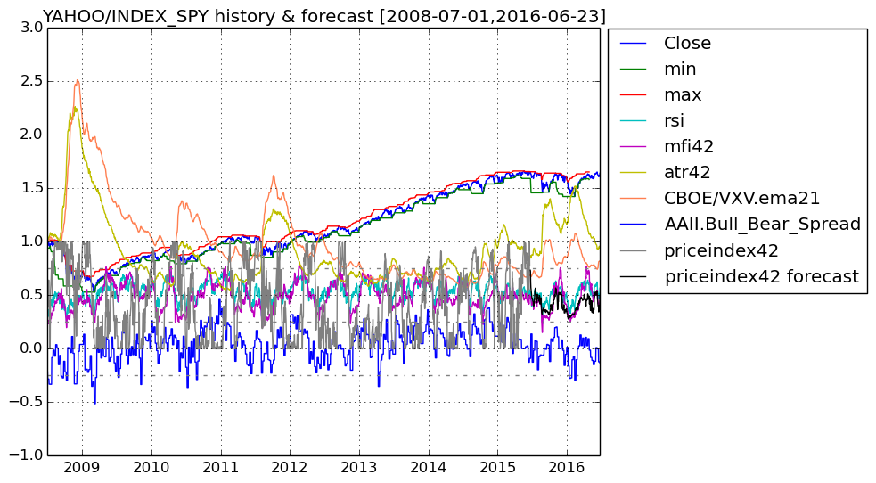
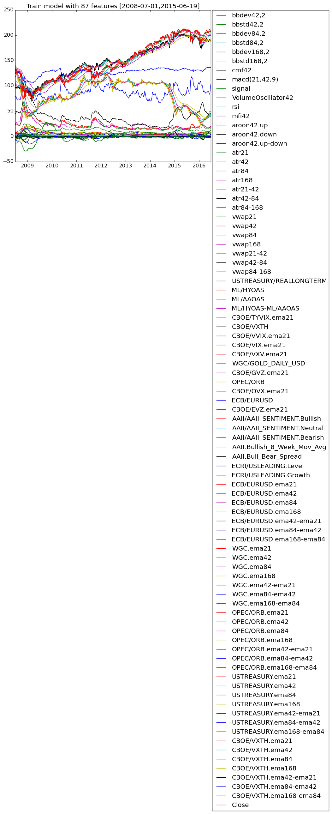

# FinancialData

## This Julia program fetches financial data from Quandl/Yahoo Finance and forecasts short-term price ranges using a random forest.

### Ensemble of Decision Trees

Trees:      100  
Avg Leaves: 420.11  
Avg Depth:  29.0

### 3-fold cross validation on regression forest

Fold 1

Mean Squared Error:     0.013124759952730639  
Correlation Coeff:      0.9504340785197969  
Coeff of Determination: 0.8809515856436015

Fold 2

Mean Squared Error:     0.012532163957448474  
Correlation Coeff:      0.9566416745919043  
Coeff of Determination: 0.8890844022633395

Fold 3

Mean Squared Error:     0.012582613773020633  
Correlation Coeff:      0.9468737348224784  
Coeff of Determination: 0.8818078055142929

#### Mean Coeff of Determination: 0.8839479311404114

