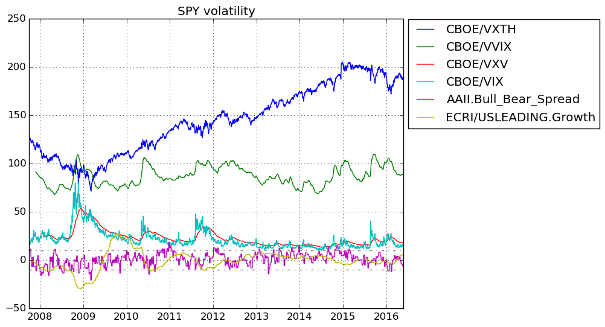

# FinancialData

## This Julia program fetches financial data from Yahoo Finance/Quandl and forecasts short-term price ranges in the future using random forests.

## Ensemble of Decision Trees

Trees:      100  
Avg Leaves: 416.1  
Avg Depth:  25.53  

## 3-fold cross validation on regression forest

Fold 1  
Mean Squared Error:     0.014695116374695024  
Correlation Coeff:      0.9448504808476776  
Coeff of Determination: 0.8611915484472361  

Fold 2  
Mean Squared Error:     0.016119746020507537  
Correlation Coeff:      0.9443718341697297  
Coeff of Determination: 0.8547136635636379  

Fold 3  
Mean Squared Error:     0.01754031279219942  
Correlation Coeff:      0.9507061928120738  
Coeff of Determination: 0.8522292266294831  

### Mean Coeff of Determination: 0.856044812880119
